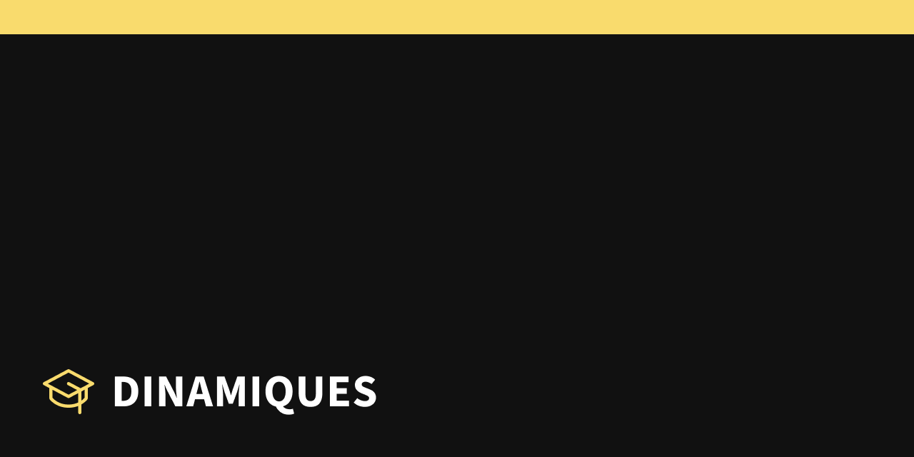

  
  

  <h1 align="center">Dinamiques: conhecimento ao alcance de todos</h1>

  
  
  <!--  -->
  

  
  
  
  
  
  

## Índice

<ol>
  <li><a href="#-sobre">Sobre</a></li>
  <li><a href="#-documentations">Documentations</a></li>
  <li><a href="#-ddd">DDD</a></li>
  <li><a href="#-database">Database</a></li>
  <li><a href="#-design">Design</a></li>
  <li><a href="#-outSystems">OutSystems</a></li>
</ol>

## Sobre

Projeto desenvolvido para o Tech Challenge da fase 01 na PosTech do curso Full Stack Development.

## Documentations

Contém arquivos da documentação principal do projeto.

- Link do [notion](https://www.notion.so/Dinamiques-conhecimento-ao-alcance-de-todos-732e0e37f7da4960a95919309a008bd0?pvs=4)

## DDD

### /contexts

Contém imagens de contextos exportadas e utilizadas na documentação principal.

### /sketches

Contém o arquivo fonte do esboço da aplicação e sua imagem exportada.

- Link do [draw.io](https://app.diagrams.net/)

### /storytelling

Contém os arquivos fonte de cada storytelling modelada de uma parte da aplicação, assim como suas imagens exportadas.

- Link do [egon.io](https://egon.io/)

> **IMPORTANTE!**
>
> 1. Foi utilizada a versão `v1`.

## Database

### /sql/modeling

Contém o arquivo fonte do diagrama entidade relacionamento **( DER )** e sua imagem exportada.

- Link do [DBDesigner 4](https://dbdesigner.softonic.com.br/)

## Design

### /examples

Contém imagens do design exportadas e utilizadas na documentação principal.

- Link do [Figma](https://www.figma.com/design/RYlAklimxsOFmPwMIrUg3V/Dinamiques?node-id=82-6&t=vYwPBMC9n9endRGZ-1)

## OutSystems

### /assets

Contém ícones e imagens separadas em pastas e que foram utilizadas na aplicação.

### /examples

#### /images

Contém imagens da aplicação exportadas e utilizadas na documentação principal.

#### /requests

Contém o arquivo `.http` com exemplos de rotas para efetuar testes aos `endpoints` da API.

- Link da extensão utilizada no VSCode [REST Client](https://marketplace.visualstudio.com/items?itemName=humao.rest-client)

### /modeling

Contém o arquivo fonte da arquitetura da aplicação e sua imagem exportada.

- Link do [draw.io](https://app.diagrams.net/)

### /modules

Contém os arquivos fonte de cada aplicação e módulo desenvolvido na plataforma `OutSystems`.

- Link da [OutSystems](https://www.outsystems.com/)

> **INFORMATIVO!**
>
> 1. **URL para visualizar a API documentada**
>
>    - https://personal-j8sqiwwn.outsystemscloud.com/Api/rest/v1/#/
>
> 2. **URL e acessos para visualizar a área administrativa**
>
>    - https://personal-j8sqiwwn.outsystemscloud.com/Administration
>
>    - **Administrador**
>      - **Nome de usuário:** Alan
>      - **Senha:** 1234
>    - **Docente**
>      - **Nome de usuário:** Luma
>      - **Senha:** 1234
>
> 3. **URL para visualizar as páginas públicas**
>
>    - https://personal-j8sqiwwn.outsystemscloud.com/Web

## Autor

<table>
  <tr>
    <td align="center">
      <a href="https://github.com/felipe-dr">
        
         
        
          <b>Felipe DR</b>
        
      </a>
       
      <a href="mailto:felipe.corp7@gmail.com" title="E-mail">📩</a>
    </td>
  </tr>
</table>
